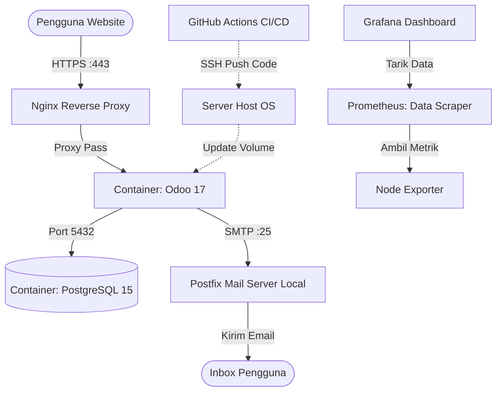

# Dokumentasi Lengkap Deployment & Konfigurasi Server \"Titik Koma\"

**Tanggal Laporan:** 26 Juni 2026  
**Dipersiapkan untuk:** Tim Pengembang / Administrator Titik Koma

---

## 1. Arsitektur Infrastruktur & Spesifikasi

Sistem ini di-deploy pada sebuah mesin peladen Virtual Private Server (VPS) bersistem operasi Linux Ubuntu. Arsitektur layanannya dirancang secara kontainerisasi (menggunakan Docker) untuk menjamin isolasi data, skalabilitas, dan kemudahan _maintenance_.

### 1.1 Spesifikasi Server & Layanan
- **Sistem Operasi:** Ubuntu Linux
- **Alamat IP Publik:** `157.66.9.171`
- **Nama Domain:** `titik-koma.my.id`
- **Versi Aplikasi Inti:** Odoo 17.0
- **Versi Database:** PostgreSQL 15
- **Repositori Kode Utama:** GitHub `arifaftr/titik-koma-odoo`

### 1.2 Skema Jaringan & Aliran Data (Arsitektur)



---

## 2. Tahap 1: Instalasi Inti (Odoo & Database)

### 2.1 Persiapan Docker & Direktori
Langkah pertama adalah melakukan instalasi Docker Engine & Docker Compose di dalam Ubuntu. Setelah itu, kode sumber di-clone dari repositori GitHub:
```bash
git clone https://github.com/arifaftr/titik-koma-odoo.git /opt/odoo/titik-koma-odoo
cd /opt/odoo/titik-koma-odoo
```

### 2.2 Konfigurasi `docker-compose.yml`
Sebuah berkas komposer Docker dibuat untuk merangkai Odoo, PostgreSQL, dan perangkat Monitoring (Grafana + Prometheus) secara bersamaan. Berikut adalah cuplikan inti konfigurasinya:
```yaml
version: '3.8'
services:
  web:
    image: odoo:17.0
    depends_on:
      - db
    ports:
      - \"127.0.0.1:8069:8069\" # Hanya bisa diakses dari reverse proxy Nginx
    volumes:
      - odoo-web-data:/var/lib/odoo
      - ./:/mnt/extra-addons # Mounting custom modules dari GitHub
    environment:
      - HOST=db
      - USER=odoo
      - PASSWORD=odoo

  db:
    image: postgres:15
    environment:
      - POSTGRES_DB=postgres
      - POSTGRES_PASSWORD=odoo
      - POSTGRES_USER=odoo
```
Database diisi dengan cara me-restore (mengembalikan) file _backup_ `.zip` lokal (`titik_koma_db`) langsung melalui antarmuka manajer database Odoo.

---

## 3. Tahap 2: Pemecahan Masalah Bug Modul (Troubleshooting)

Setelah instalasi selesai, kami menemukan indikasi `500: Internal Server Error` saat melakukan login. Pelacakan log (*Traceback*) Odoo menunjukkan _Error_:
> `KeyError: 'student.journal'`

**Akar Permasalahan (Root Cause):**
Model `student.journal` gagal dimuat ke dalam memori aplikasi karena terdapat modul dependensi yang hilang/tidak terdeteksi, yakni `student_mood_tracking` dan `mental_health`. 
Padahal pada direktori sistem, nama foldernya adalah `moodtracker` dan `mental_health_chatbot`. Odoo secara ketat mewajibkan agar nama direktori sama persis dengan atribut penamaan teknis (_manifest_ name) modulnya.

**Solusi & Perbaikan:**
1. Mengubah nama direktori `moodtracker` -> `student_mood_tracking`.
2. Mengubah nama direktori `mental_health_chatbot` -> `mental_health`.
3. Mengoreksi _hardcoded paths_ dalam file `__manifest__.py` dan templat `.xml`/`.css` secara menyeluruh melalui pencarian dan penggantian (Regex Sed).
4. Me-restart layanan container web.

---

## 4. Tahap 3: Sertifikat Keamanan SSL & HTTPS

Untuk memastikan kerahasiaan pertukaran data, API Key AI, dan informasi kredensial login pengguna, lalu lintas situs web dialihkan ke lalu lintas terenkripsi HTTPS.

1. **Instalasi Nginx & Certbot**
   ```bash
   apt-get install nginx certbot python3-certbot-nginx
   ```
2. **Server Block Configuration (`/etc/nginx/sites-available/titik-koma.my.id`)**
   ```nginx
   server {
       listen 80;
       server_name titik-koma.my.id;

       location / {
           proxy_pass http://127.0.0.1:8069;
           proxy_set_header X-Forwarded-Host \$host;
           proxy_set_header X-Forwarded-For \$proxy_add_x_forwarded_for;
           proxy_set_header X-Forwarded-Proto \$scheme;
           proxy_set_header X-Real-IP \$remote_addr;
           proxy_read_timeout 300000;
       }
       client_max_body_size 100M;
   }
   ```
3. **Penerbitan SSL Utama & Subdomain**
   Sertifikat hijau Let's Encrypt dipasang secara otomatis menggunakan `certbot --nginx` untuk dua nama host:
   - `titik-koma.my.id` (Aplikasi Odoo Utama)
   - `monitoring.titik-koma.my.id` (Aplikasi Dasbor Grafana)
   Certbot juga dikonfigurasi untuk memberikan aturan _Auto-Redirect HTTP 80 ke HTTPS 443_.

---

## 5. Tahap 4: Sistem Pengiriman Email (Postfix SMTP)

Agar Odoo memiliki kapabilitas untuk merutekan dan mengirim notifikasi berbasis email dengan nama domain kustom (contoh: `admin@titik-koma.my.id`), kita menugaskan Postfix sebagai _Mail Transfer Agent_.

- **Konfigurasi Postfix (`main.cf`)**
  - `myhostname = titik-koma.my.id`
  - `mydomain = titik-koma.my.id`
  - `mynetworks = 127.0.0.0/8 172.16.0.0/12` (Memberikan izin _relay_ bebas-otentikasi kepada container internal Docker).
- **Konfigurasi DNS**
  Sebuah TXT Record (SPF) ditambahkan pada penyedia nama domain:
  - `v=spf1 ip4:157.66.9.171 ~all`
- **Konfigurasi Outgoing Mail Server Odoo**
  Dialihkan ke `157.66.9.171` via Port 25 tanpa memerlukan otentikasi kata sandi SMTP. Tes pengiriman berhasil mendarat di alamat surel tujuan.

---

## 6. Tahap 5: Pemantauan Performa (Grafana Monitoring)

Untuk melakukan audit pemakaian sumber daya perangkat keras server:
1. **Node Exporter & Prometheus:** Dijalankan via Docker untuk secara konstan membongkar angka utilisasi metrik perangkat keras (CPU, RAM).
2. **Grafana:** Diaktifkan pada Port `3000` dengan sumber data `http://prometheus:9090`.
3. Dasbor standar yang digunakan adalah Dasbor Node Exporter (ID: `1860`) yang dimuat secara resmi dari inventaris Grafana Foundation.
4. Grafana ini diisolasi di balik Nginx Reverse Proxy dan diberikan enkripsi SSL penuh melalui rute `monitoring.titik-koma.my.id`.

---

## 7. Tahap 6: CI/CD Pipeline dengan GitHub Actions

Disediakan alur kerja (*Workflow*) untuk _Continuous Integration/Continuous Deployment_ (CI/CD) agar setiap modifikasi kode ke dahan (_branch_) utama secara otomatis diaplikasikan ke peladen tanpa perlu login manual secara SSH.

1. **Memperbaiki Kendala SSH Ubuntu Cloud Image**
   Layanan `sshd` pada server diubah untuk menerima autentikasi berbasis _password_ demi mengakomodasi tindakan masuk bot GitHub Actions:
   ```bash
   sed -i 's/PasswordAuthentication no/PasswordAuthentication yes/g' /etc/ssh/sshd_config.d/60-cloudimg-settings.conf
   systemctl restart ssh
   ```
2. **GitHub Secrets**
   Disisipkan tiga kredensial rahasia pada panel repositori: `SERVER_HOST`, `SERVER_USER`, dan `SERVER_PASSWORD`.
3. **Konfigurasi `.github/workflows/deploy.yml`**
   ```yaml
   name: Deploy to Server
   on:
     push:
       branches: [ main ]
   jobs:
     deploy:
       runs-on: ubuntu-latest
       steps:
         - name: Deploy to Server via SSH
           uses: appleboy/ssh-action@v1.0.3
           with:
             host: \${{ secrets.SERVER_HOST }}
             username: \${{ secrets.SERVER_USER }}
             password: \${{ secrets.SERVER_PASSWORD }}
             script: |
               cd /opt/odoo/titik-koma-odoo
               git pull origin main
               docker compose restart web
   ```

---

## 8. Informasi Akses Sistem (Kredensial Login)

Untuk mengakses dan mengelola sistem yang telah berjalan secara _Live_ (Production), Anda dapat menggunakan tautan dan kredensial berikut:

### 🌐 Akses Aplikasi Utama (Odoo)
- **URL (Tautan):** [https://titik-koma.my.id](https://titik-koma.my.id)
- **Email Login:** `admin@titik-koma.my.id`
- **Password:** `r00tunisa`

### 📊 Akses Dasbor Monitoring (Grafana)
- **URL (Tautan):** [https://monitoring.titik-koma.my.id](https://monitoring.titik-koma.my.id)
- **Username:** `admin`
- **Password:** `r00tunisa`

---
**Catatan Tambahan:**
- Kata sandi super-admin (*Master Password*) yang digunakan untuk pengelolaan siklus database (backup/restore) Odoo adalah **`stqv-6s8i-qwwe`**. Harap simpan dan rahasiakan dengan baik.
- Pemeliharaan rutin di masa mendatang hampir sepenuhnya tidak diperlukan karena integrasi Docker untuk web dan Certbot untuk SSL dirancang berjalan otomatis di latar belakang.

**-- AKHIR DOKUMEN --**

